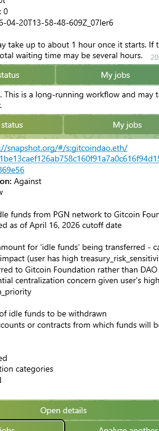

# gov-ai

AI assistant for DAO governance proposals.

## Table of Contents

- [Week 17 - Multi-Agent Systems (Web2)](#week-17---multi-agent-systems-web2)
- [Week 16 - Trust and Verification (Web2)](#week-16---trust-and-verification-web2)
- [Week 14 - State, Memory and Throughput (Web2)](#week-14---state-memory-and-throughput-web2)
- [Week 12 - Ambient vs Closed Baseline Benchmark (Web2)](#week-12---ambient-vs-closed-baseline-benchmark-web2)
- [Week 11 - Agents and Composability (Web2)](#week-11---agents-and-composability-web2)
- [Week 10 - Load the System (Web2)](#week-10---load-the-system-web2)
- [Week 9 - Proof Over Vibes (Web2)](#week-9---proof-over-vibes-web2)
- [Week 8 - Design for Many Small Miners (Web2)](#week-8---design-for-many-small-miners-web2)
- [Week 7 - System Identity (Web2)](#week-7---system-identity-web2)
- [Week 6 - Refusal handling (Web2)](#week-6---refusal-handling-web2)
- [Downstream handling (routing)](#downstream-handling-routing)
- [Moderator checklist (Week 6 Web2)](#moderator-checklist-week-6-web2)
- [Supported sources](#supported-sources)
- [Setup](#setup)
- [Init user principles](#init-user-principles)
- [Run analysis (CLI)](#run-analysis-cli)
- [Two modes: CLI and API](#two-modes-cli-and-api)
- [Output format](#output-format)
- [Example reports](#example-reports)
- [API server (production-style)](#api-server-production-style)
- [Report viewer (pageServer.js)](#report-viewer-pageserverjs)
- [Benchmark (Web2 Micro-Challenge #4)](#benchmark-web2-micro-challenge-4)
- [Week 5 - Verification boundaries (Micro-Challenge #5)](#week-5---verification-boundaries-micro-challenge-5)
- [Important limitations](#important-limitations)
- [What this project is NOT](#what-this-project-is-not)

This project started as **Web3 Developer Loop - Experiment #3 (AI for governance or automation)**.
It now also documents and ships:
- Week 17 multi-agent systems (Web2): deterministic governance-council layer with research, risk, decision, and verification agents sharing one JSON memory artifact
- Week 16 trust and verification (Web2): local proposal fixture support for reproducible developer-loop runs, a treasury-spending scenario, and stricter verification hooks that keep unknown claims unverifiable even when they contain hard literals
- Week 14 state, memory and throughput (Web2): JSON-backed state layer, bounded prompt-state injection, Ambient API/SGLang live benchmark artifacts, and a separate User Loop chat instruction
- Week 12 ambient vs closed baseline benchmark (Web2): developer-loop comparison of Ambient against GPT-5.4 via OpenRouter, with output-quality, latency, failure-mode, and benchmark artifact reporting
- Week 5 verification boundaries (verifiable vs interpretive layers)
- Week 6 refusal handling (Web2): deterministic refusal detection plus routing and human review tickets
- Week 7 system identity (Web2): exposes system identity, verification boundaries, and refusal handling in the UI
- Week 8 design for many small miners (Web2): dynamic timeout, financial proposal detection, multi-node consensus analysis
- Week 9 proof over vibes (Web2): deterministic / probabilistic / unverifiable verification hooks with optional strict routing
- Week 10 load the system (Web2): controlled single-node parallel stress testing with load artifacts and failure-mode tracking
- Week 11 agents and composability (Web2): Telegram bot layer, queueing, human-readable summaries, and optional detailed web view on top of the existing gov-ai pipeline

It takes a proposal URL (Snapshot, Tally, DAO DAO, Mintscan), extracts available data, and produces a structured analysis:
- summary of the proposal
- key changes
- benefits
- risks
- unknowns / missing information
- recommendation based on user principles
- explicit limitations

The design goal is **honesty and conservatism**:
- if some data cannot be extracted, it is marked as `UNKNOWN`
- the tool does not guess voting options or results
- the output is meant to **assist** human decision-making, not replace it

---

## Week 17 - Multi-Agent Systems (Web2)

Week 17 asks for multiple specialized agents, shared state, and a multi-step workflow. In `gov-ai`, this is implemented as a deterministic post-analysis governance council rather than as a throwaway prompt demo.

### Week 17 product change

The new council runs over an existing `gov-ai` proposal/report pair and writes a shared JSON memory object:

1. Research agent extracts grounded facts: title, amount, addresses, voting options, and missing evidence.
2. Risk analysis agent reads those facts and upgrades execution/evidence gaps into severity-labeled risks.
3. Decision agent reads facts and risks, then selects a voting option and explicit blockers.
4. Verification agent checks that high-severity risks propagated into the decision and hashes the shared state.

This adds an auditable review layer on top of the normal report. It is deterministic, does not require secrets, and can be attached to human review tickets or Discord evidence without exposing API keys.

### Run the Week 17 demo

```bash
node gov-ai.js multi-agent-review examples/week16-trust-verification/gov-ai-main-report.json examples/week16-trust-verification/treasury-transfer-proposal.json examples/week17-multi-agent-systems
```

Equivalent example entry point:

```bash
node examples/run-week17-multi-agent-council.js
```

### Week 17 artifacts

Reviewers can inspect the committed evidence here:

- `week17-multi-agent.js` - reusable multi-agent council module
- `week17-multi-agent.test.js` - tests for ordering, shared memory, risk propagation, and artifacts
- `examples/run-week17-multi-agent-council.js` - reproducible local runner
- `examples/week17-multi-agent-systems/multi-agent-council-output.json` - shared-state output
- `examples/week17-multi-agent-systems/multi-agent-council-report.md` - human-readable workflow report
- `examples/week17-multi-agent-systems/multi-agent-workflow.svg` - workflow screenshot-style diagram

### Short Week 17 outcome summary

On the retained treasury-transfer fixture, the council found that the proposal requests a `250,000 USDC` transfer to `0x1234567890abcdef1234567890abcdef12345678`, while invoice, signer-list, recipient-control, and budget-breakdown evidence remain unresolved. The decision agent preserved the conservative `Against` recommendation, and the verification agent returned `verified` with a hash over facts, risks, and decision state.

---

## Week 16 - Trust and Verification (Web2)

Week 16 asks: **Can you trust execution?** For `gov-ai`, this maps directly to a governance task where correctness matters before voting on a treasury spend.

This repository now supports a reproducible developer-loop path for local proposal fixtures:

```bash
MULTI_NODE_ENABLED=false AMBIENT_STREAM=false AMBIENT_MODEL=zai-org/GLM-5.1-FP8 node gov-ai.js analyze examples/week16-trust-verification/treasury-transfer-proposal.json
```

That command uses the normal product pipeline:

1. `fetchAndExtract()` reads the local proposal fixture.
2. `analyzeWithLLM()` sends the same governance-analysis contract through Ambient.
3. `gov-ai.js` adds verification boundaries, verification hooks, refusal handling, routing, and a report under `reports/`.

### Week 16 scenario

The retained fixture is a DAO treasury-spending proposal:

- transfer `250,000 USDC` from the community treasury;
- destination `0x1234567890abcdef1234567890abcdef12345678`;
- stated purpose: Q2 grants funding;
- recipient is described as the grants multisig;
- missing evidence: invoice, signer list, recipient-control proof, and budget breakdown.

### Product change

The important product improvement is not a separate Week 16-only classifier. The core verification hooks now treat `analysis.unknowns` as `unverifiable` even when an unknown contains a hard literal such as an address or amount.

Why: a literal address is deterministic text, but it does not prove control, signer authorization, recipient legitimacy, or spending justification.

### Week 16 artifacts

Reviewers can inspect the committed evidence here:

- `examples/week16-trust-verification/treasury-transfer-proposal.json` - reproducible local proposal input
- `examples/week16-trust-verification/gov-ai-main-report.json` - report produced by the main `gov-ai.js` pipeline
- `examples/week16-trust-verification/gov-ai-verification-hooks-output.json` - focused verification-hook snapshot
- `examples/week16-trust-verification/ambient-api-userloop-result.json` - supplementary Ambient API result used during exploration
- `examples/week16-trust-verification/README.md` - Week 16 interpretation and reproduction notes

### Short Week 16 outcome summary

Observed product behavior:

- deterministic proposal literals remain visible as source facts;
- risk analysis stays probabilistic;
- unresolved recipient control and budget justification remain `unverifiable`;
- routing returns `WARN` when unresolved unknowns require external evidence;
- verified inference/provenance is treated as useful evidence about execution, not as proof that the proposal's external claims are true.

---

## Week 14 - State, Memory and Throughput (Web2)

Week 14 tests whether faster inference is useful when the system also has explicit state.

The weekly frame was:
- memory without performance is unusable
- performance without memory is a stateless tool

This repository handles the **Developer Loop** part. The User Loop remains a separate Ambient Chat browser test and is documented as an instruction artifact, not as a `gov-ai` substitute.

### What Week 14 tracks

The developer benchmark tracks:
- latency - practical response time through Ambient API after the SGLang rollout
- throughput - repeated and parallel requests
- consistency - valid JSON structure and exact-output stability
- state overhead - no-memory prompts vs prompts with bounded prior state
- failure cases - connection, timeout, HTTP, retry, and invalid-output paths

### Week 14 implementation changes

Added a dedicated prototype folder:
- `week14-stateful-sglang/memory-store.js` - JSON-backed session memory
- `week14-stateful-sglang/prompt-state.js` - bounded prior-state prompt injection
- `week14-stateful-sglang/sglang-bench.js` - OpenAI-compatible live benchmark runner
- `week14-stateful-sglang/week14.test.js` - local tests for memory, prompt state, stability, and benchmark summary helpers

The main `gov-ai` analysis pipeline is unchanged.

### Week 14 benchmark artifacts in this repository

Reviewers can inspect committed example artifacts here:
- `examples/week14-stateful-sglang/week14-sglang-bench-2026-05-14T22-45-46-461Z.json`
- `examples/week14-stateful-sglang/week14-sglang-bench-2026-05-14T22-45-46-461Z.txt`
- `examples/week14-stateful-sglang/week14-sglang-bench-2026-05-14T22-46-55-659Z.json`
- `examples/week14-stateful-sglang/week14-sglang-bench-2026-05-14T22-46-55-659Z.txt`
- `examples/week14-stateful-sglang/week14-sglang-bench-2026-05-14T22-49-25-553Z.json`
- `examples/week14-stateful-sglang/week14-sglang-bench-2026-05-14T22-49-25-553Z.txt`
- `examples/week14-stateful-sglang/sglang-live-benchmark-rollup.md`
- `examples/week14-stateful-sglang/user-loop-manual-instruction.md`

### Short Week 14 outcome summary

The retained live runs used Ambient API with model `zai-org/GLM-5.1-FP8`.

Observed across retained live artifacts:
- serial 3-run mode completed successfully for both no-memory and with-memory prompts
- parallel 3-run mode completed successfully for both no-memory and with-memory prompts
- parallel 5-run mode completed successfully for both no-memory and with-memory prompts
- aggregate retained benchmark result: 11/0 ok/fail for no-memory and 11/0 ok/fail for with-memory
- latency was roughly in the 20-28 second range for these small live runs
- Week 12 Ambient benchmark in this repo averaged about 141 seconds, so Week 14 is a strong directional improvement, but not a strict apples-to-apples before/after test
- with-memory prompt overhead was small in these runs
- JSON structure was valid, but exact byte-for-byte output stability was low

Important limitation:
- this is a developer-loop benchmark through the Ambient API, not the User Loop browser-chat test
- output stability here means exact output stability, not semantic correctness
- the benchmark supports a cautious report: faster and usable with explicit state, but still not a substitute for memory design

---

## Week 12 - Ambient vs Closed Baseline Benchmark (Web2)

Week 12 focuses on a cleaner developer-loop benchmark: **Ambient vs one strong closed baseline** instead of comparing Ambient to another open-ish provider.

The current closed baseline is:
- `openai/gpt-5.4` via OpenRouter

### Why this framing is better

This makes the benchmark easier to interpret:
- candidate under test: Ambient
- reference baseline: GPT-5.4
- same proposal URL
- same extracted input
- same prompt contract

That gives a clearer answer to the practical question:
**how does Ambient compare with a strong closed model on this governance-analysis task?**

### What Week 12 benchmark tracks

The benchmark is aimed at the **developer loop**, not end-user UX.

It tracks three things:
- output quality - parseable JSON, schema shape, completeness
- latency - `min`, `avg`, `median`, `p95`, `max`
- failure modes - deterministic classification of benchmark failures

### Week 12 implementation changes

The benchmark path was updated to:
- replace the old Nous comparison path with OpenRouter GPT-5.4
- keep the benchmark to a strict two-model comparison
- move benchmark-only evaluation logic into `bench-helpers.js`
- add automated tests in `bench.test.js`
- keep the main governance-analysis pipeline unchanged

### Week 12 benchmark artifacts in this repository

Reviewers can inspect committed example artifacts here:
- `examples/bench-results/week12-ambient-vs-gpt54-smoke-2026-05-01.json`
- `examples/bench-results/week12-ambient-vs-gpt54-smoke-2026-05-01.txt`
- `examples/bench-results/week12-ambient-vs-gpt54-3runs-2026-05-01.json`
- `examples/bench-results/week12-ambient-vs-gpt54-3runs-2026-05-01.txt`

These include:
- one smoke-check run for configuration validation
- one 3-run benchmark for a more stable latency / reliability snapshot

### Short Week 12 outcome summary

For the retained 3-run artifact on the current proposal URL:
- both providers returned valid, schema-shaped outputs in all 3/3 runs
- benchmark quality was effectively a tie under the current deterministic rubric
- GPT-5.4 via OpenRouter was dramatically faster in this test window
- Ambient did not return usage data in these runs, so cost comparison remains incomplete on the Ambient side

Important limitation:
- this benchmark measures practical developer-loop behavior, not semantic correctness of the report content
- the latency gap is a real observed result for this run window, but should still be treated as workload- and provider-state-dependent

---

## Week 11 - Agents and Composability (Web2)

Week 11 adds a user-facing orchestration layer on top of the existing gov-ai analysis engine.

The key design choice is composability without rewriting the core:
- `gov-ai.js` remains the source-of-truth analysis engine
- `pageServer.js` remains the detailed report surface
- a new Telegram bot layer sits on top as transport and orchestration
- the bot runs analysis jobs, tracks state, and returns human-readable output instead of raw JSON

### Why this matters

This turns Ambient from a one-off model call into infrastructure inside a small real system:
- input validation
- queueing
- job execution
- structured analysis
- human-readable summary
- detailed page view

That is much closer to an actual product loop than isolated chat usage.

### Week 11 bot MVP

Telegram bot: [GovAiAmbientBot](https://t.me/GovAiAmbientBot)

The MVP adds:
- Telegram bot entry point
- file-per-job persistence under `jobs/`
- FIFO queue with one active analysis at a time
- per-user active job limit (maximum 2 in `queued` or `running`)
- supported-source URL validation before analysis starts
- child-process execution of the existing `gov-ai.js`
- report discovery from `reports/`
- short Telegram summaries from report JSON
- optional detailed page link when the page server is available

### User experience

The bot is designed for long-running governance analysis rather than instant replies.

Behavior:
- user sends a supported proposal URL
- bot validates the URL before using paid inference
- job is queued and persisted
- bot sends queue position and job id
- bot later sends a "started" message when execution begins
- bot automatically sends a final human-readable summary on completion
- inline buttons support status checks and recent-job listing

Primary status model:
- `queued`
- `running`
- `completed`
- `failed`

### Summary shape

The Telegram result is intentionally human-readable and concise.

It includes:
- proposal label
- recommendation
- confidence
- key changes
- risks
- unknowns
- warnings
- optional detailed page link

For supported sources, proposal labels are shortened for readability:
- Snapshot, `<space>`, `<proposal id short>`
- Tally, `<organization>`, `<proposal id short>`
- DAO DAO, `<dao slug>`, `<proposal id short>`
- Mintscan, `<chain>`, `<proposal id short>`

### Detailed page view

If a detailed page base URL is configured, or if the local page server can be started automatically, the bot includes a detailed page link instead of forcing users to inspect raw JSON.

This preserves a layered experience:
- short summary in Telegram
- deep detail in web view
- raw JSON remains an internal artifact

### Example Telegram flow



Telegram bot flow: URL submission, queued analysis, and human-readable result delivery.

### Architectural rule

Week 11 intentionally does **not** rewrite the existing analysis engine.

The bot layer composes with the current system instead of replacing it.
This keeps the project maintainable and makes the composability story stronger:
Ambient is embedded into a workflow, not rebuilt as a separate parallel stack.

## Week 10 - Load the System (Web2)

Week 10 focused on real parallel load using the real gov-ai workload shape, while intentionally avoiding the full financial multi-node orchestration path.

### Why a separate Week 10 mode exists

The normal financial path in `gov-ai.js` can invoke:
- financial proposal detection
- 3-attempt multi-node analysis
- consensus selection
- retry / backoff behavior
- full streaming verification lifecycle

That makes the default production-style path useful for real analysis, but poor as a clean parallel benchmark unit. For Week 10, this repository uses a **controlled single-node mode** instead:
- same extracted proposal input
- same governance-analysis prompt shape
- same JSON report contract
- streaming enabled for timing + Ambient metadata capture
- multi-node financial orchestration intentionally bypassed

This keeps the workload meaningful while making the benchmark interpretable.

### Week 10 harness

Week 10 uses a dedicated load harness:
- script: `week10-load.js`
- artifact folder: `load-reports/`

The harness records, per run:
- first token latency
- full completion time
- success / failure / timeout status
- refusal and routing signals
- Ambient metadata when available (`request_id`, `merkle_root`, validator line, auction, bidder)

The harness writes two artifact types:
- `load-result-<runs>-<timestamp>.json` — machine-readable raw run data + aggregates
- `load-summary-<runs>-<timestamp>.md` — human-readable summary

### Retained Week 10 artifact set

The final retained Week 10 checkpoints are:
- `1 / 1`
- `5 / 5`
- `10 / 10`
- `50 / 50`
- `100 / 100`

These artifacts are kept in `load-reports/`.

### Workload used

Proposal used for the retained Week 10 runs:
- Snapshot / Aave DAO proposal
- URL stored in `.env` as `PROPOSAL_URL`

Test mode used:
- extracted input reused across runs
- controlled single-node mode
- streaming enabled
- strict verification hooks disabled

### Week 10 results summary

Observed behavior across retained checkpoints:
- `1 / 1` — stable baseline, first token ~3.8s, completion ~20 min
- `5 / 5` — still 100% success, first token ~2.5s, completion ~20 min
- `10 / 10` — 100% success, but first token jumps to ~49s while completion stays ~20 min
- `50 / 50` — success rate drops to 86%; first real failures appear (`no_stream_content`, `HTTP 429`)
- `100 / 100` — success rate drops to 36%; dominant failure mode becomes `HTTP 429 Too many concurrent requests`

Important pattern:
- completion time for accepted runs stayed close to ~20 minutes even at higher load
- first-token latency did **not** degrade monotonically
- the clearest system limit showed up first in **reliability / admission failure**, not in total completion time

### How to interpret Week 10 honestly

This Week 10 benchmark does **not** claim to be a full end-to-end benchmark of the default financial multi-node production path.

What it does show:
- how the real gov-ai workload behaves in controlled single-node parallel execution
- how first-token responsiveness changes under load
- where streaming reliability starts to fail
- where rate limiting becomes the dominant system boundary

This makes Week 10 useful as a practical stress test and failure-mode map, even though the full production financial path remains a separate, longer-running workflow.

## Week 9 - Proof Over Vibes (Web2)

Week 9 adds a second post-processing layer: `verification_hooks`.

It classifies report fragments into:
- `deterministic` - directly anchored to extracted title/body/options, evidence quotes, or hard literals
- `probabilistic` - inference-heavy or recommendation-oriented statements (risks, benefits, confidence, likely outcomes)
- `unverifiable` - vague or weakly grounded statements without a clear anchor

Additional Week 9 signals:
- `mixed_categories_detected` - one report field contains multiple categories across its sentence-level segments
- `requires_separation` - mixed content should be split more explicitly
- `strict_rejection_triggered` - enabled when `STRICT_VERIFICATION_HOOKS=true` and mixed categories are found
- `routing_action` - `ALLOW`, `WARN`, or `HUMAN_REVIEW`

### Strict mode

Set in `.env` or shell:

```env
STRICT_VERIFICATION_HOOKS=true
```

Behavior:
- `false` (default): mixed or unverifiable content is surfaced as a warning in the report/UI
- `true`: mixed-category output is escalated to human review and included in the routing ticket

### Limits

- This is still heuristic classification, not cryptographic proof of truth.
- A deterministic label means the text is mechanically anchorable, not that the source itself is trustworthy.
- Sentence splitting is intentionally conservative to avoid destabilizing earlier Week 5-8 flows.

### Week 9 example artifacts

A full Week 9-style example generated from a live run is included in:
- `examples/reports/report-2026-03-27T18-42-51-048Z.json`
- `examples/routes/route-2026-03-27T18-42-51-049Z.json`
- `examples/reviews/ticket-2026-03-27T18-42-51-049Z.json`

This example shows `verification_hooks` in the report plus the downstream routing/review artifacts.

## Week 8 - Design for Many Small Miners (Web2)

Week 8's goal: "Design for many small miners."

This project implements solutions for handling variable miner speeds in a decentralized network.

### LatencyTracker (Dynamic Timeout)

Adaptive timeout based on rolling median of recent latencies:
- Stores last N latency measurements
- Timeout = median * 3
- Default: 60s if less than 3 measurements

### Financial Proposal Detection

Automatic detection of financial proposals using pattern matching:
- Dollar amounts: `$2.5M`, `$100K`
- Crypto tokens: `USDC`, `ETH`, `DAI`, `AAVE`, `ENS`
- Financial verbs: `transfer`, `allocate`, `distribute`, `fund`
- Treasury terms: `treasury`, `endowment`, `budget`, `revenue`
- Ethereum addresses: `0x...`

Minimum 2 pattern matches = financial proposal.

### Multi-Node Analysis (Consensus)

For financial proposals, the system runs 3 independent analyses:
1. Makes 3 requests to different nodes
2. Saves each result to `./temp/multi-node/`
3. Compares recommendations (suggested_option only: YAE/NAY/UNKNOWN)
4. Selects by consensus (2+ identical = consensus)
5. If no consensus, takes first result

Results saved:
- `analysis-{timestamp}-attempt-{N}.json` - each attempt
- `analysis-{timestamp}-chosen.json` - final choice with reason

### Configuration

- `MULTI_NODE_ENABLED` (default: true) - enable multi-node for financial proposals
- Set in environment or `.env` file

### Progress Logging

Enhanced console output:
```
==================================================
GovAI Analysis - 2026-03-22T10:54:00.000Z
```

### Example Reports (Week 8)

Example from Week 8 testing on DAO DAO Injective proposal:

- [report-2026-03-22T13-38-05-856Z.json](examples/reports/report-2026-03-22T13-38-05-856Z.json)
- [ticket-2026-03-22T13-38-05-856Z.json](examples/reviews/ticket-2026-03-22T13-38-05-856Z.json)
- [route-2026-03-22T13-38-05-856Z.json](examples/routes/route-2026-03-22T13-38-05-856Z.json)
Proposal: https://daodao.zone/...
==================================================
Fetching and extracting proposal data...
[2026-03-22T10:54:01.000Z] Starting analysis for: ...
[2026-03-22T10:54:01.000Z] Checking if financial proposal... YES
[2026-03-22T10:54:02.000Z] Financial proposal detected - running multi-node analysis...
[2026-03-22T10:54:15.000Z] Consensus check: 3 identical out of 3 (by suggested_option)
```

---
## Week 7 - System Identity (Web2)

Week 7's goal: "Expose system identity in your app."

This project now exposes system identity through collapsible sections in the report viewer:

### Verification Boundary Section
Shows which parts of the analysis are deterministic (verifiable) vs interpretive (require human review):
- **Deterministic**: Fields that can be directly verified from extracted data
- **Interpretive**: Fields requiring human judgment
- **Uncertainty Flags**: Signals indicating incomplete information
- **Method**: How boundaries are determined

### Refusal Handling Section
Displays when the system refused to provide a recommendation:
- **Refusal Detected**: Yes/No indicator
- **Signals**: What triggered the refusal (e.g., `unknowns_present`, `low_confidence`)
- **Routed To**: Where the request was forwarded (e.g., `HUMAN_REVIEW`)

### Prompt Used Section
Shows the prompt that generated the analysis:
- Summary of prompt intent
- Excerpt of prompt text
- Model used

### Week 7 Evaluation Section
For reports tagged with Week 7 evaluation:
- What surprised the tester
- Where external explanation was needed

The UI uses color-coded collapsible sections:
- 🔵 Blue: Week 7 evaluation
- 🟡 Yellow: Verification boundaries
- 🔴 Red: Refusal handling
- 🟢 Green: Prompt used

---


## Week 6 - Refusal handling (Web2)

Refusal is a **system decision**, not just model text.

The detector uses deterministic signals from the produced report and extracted input:
- `recommendation.suggested_option == "UNKNOWN"`
- `recommendation.confidence == "low"`
- missing extracted options (`extracted.options` is empty)
- `analysis.unknowns` is present (underspecified inputs)
- `extracted.source_type == "generic"` (incomplete-source signal)

Current conservative trigger rule marks refusal when high-signal conditions are present (`UNKNOWN` option, low confidence, missing options, or unknowns present). The system can still route to review based on incomplete inputs even when model wording sounds confident.

---

## Downstream handling (routing)

CLI runs produce explicit downstream artifacts:
- full report in `reports/`
- routing decision in `routes/route-*.json` for every run
- review ticket in `reviews/ticket-*.json` when refusal is detected

Review tickets store a reference to `report_path` instead of duplicating the report payload.
This keeps refusal behavior observable and auditable across report, route, and review artifacts.

---

## Moderator checklist (Week 6 Web2)

- Prompt used: `report.input.prompt_used`
- Refusal state and signals: `report.refusal_handling.refusal_detected` and `report.refusal_handling.signals`
- Routing trail: `routes/`, `reviews/`, and the referenced report in `reports/`

---

## Supported sources

- Snapshot (via official GraphQL API)
- Tally (via official GraphQL API, requires API key)
- DAO DAO (via Next.js `__NEXT_DATA__` fallback extraction)
- Mintscan (via Mintscan proposal API field mapping)
- Any other site: generic HTML text fallback (best-effort)

**Note on Tally URLs:** Tally URLs may use organization slug in the format `/gov/<slug>/...`. The tool resolves the governor address via the Tally API.

---

## Setup

```bash
npm install
```

Create `.env` (see `.env.example` for reference):

```env
AMBIENT_API_KEY=...
PROPOSAL_URL="https://..."
TALLY_API_KEY=...   # optional, only for tally.xyz
PORT=3000           # optional, default port for gov-ai-api.js
PAGE_PORT=3100      # optional, default port for pageServer.js
```

**Environment variables:**
- `AMBIENT_API_KEY` (required) - API key for Ambient inference provider
- `PROPOSAL_URL` (required for CLI) - URL of the proposal to analyze
- `TALLY_API_KEY` (optional) - API key for Tally GraphQL API, required only for Tally proposals
- `PORT` (optional) - Port for the HTTP API server (default: 3000)
- `PAGE_PORT` (optional) - Port for the report viewer server (default: 3100)

---

## Init user principles

```bash
node gov-ai.js init
```

Edit `principles.json` and fill in your preferences.

---

## Run analysis (CLI)

```bash
node gov-ai.js
```

or

```bash
node gov-ai.js analyze <url>
```

The result will be saved as:

- `reports/report-*.json` - full analysis report
- `routes/route-*.json` - routing decision
- `reviews/ticket-*.json` - review queue ticket (only when refusal is detected)

Notes:
- CLI report filenames still use source-aware naming when available (for example `report-snapshot-...`, `report-tally-...`, or `report-<timestamp>.json`).
- `reports/`, `routes/`, and `reviews/` are created automatically by the CLI when needed.

---

## Two modes: CLI and API

This repository contains two ways to run the project:

- `gov-ai.js` - CLI / demo version for local usage and experiments.
- `gov-ai-api.js` - minimal HTTP API server suitable as a base for a service.

Both use the same core logic (`fetcher.js` and `analyzer.js`) and produce the same report JSON format.

---

## API server (production-style)

To run the HTTP API server:

```bash
node gov-ai-api.js
```

By default it starts on:

```
http://localhost:3000
```

(you can override the port via `PORT` environment variable)

### Endpoints

#### POST /analyze

Starts analysis in background and returns a job id.

Request body:

```json
{
  "url": "https://...",
  "principles": { }
}
```

If `principles` is not provided, the server uses `principles.json`.

Response:

```json
{
  "status": true,
  "job_id": "2026-01-24T13-05-12-123Z",
  "queued": true
}
```

#### GET /job/:id

Returns the result when ready.

If not ready:

```json
{ "status": false }
```

If ready:

```json
{
  "status": true,
  "report": { }
}
```

---

## Report viewer (pageServer.js)

To view saved reports in a browser, run the report viewer server:

```bash
node pageServer.js
```

By default it starts on:

```
http://localhost:3100
```

(you can override the port via `PAGE_PORT` environment variable)

The viewer provides:
- A list of all saved reports in the `reports/` directory
- Individual report pages with structured display of all analysis fields
- Support for English (default) and Russian via `?lang=ru` query parameter
- Rendering of the `benefits` field alongside other analysis sections
- Display of `__ambient` verification metadata when present in the report JSON

Page server behavior:
- It reads reports from `./reports/`.
- Example files are not loaded automatically at runtime.
- To view bundled examples in the browser, copy files from `examples/reports/` into `reports/`.

---

## prod-reports

When using the API server, finished reports are saved to the `prod-reports/` folder:

```
prod-reports/<job_id>.json
```

This folder acts as a simple file-based storage for completed jobs.

---

## Output format

The tool produces a structured JSON report with these main blocks:

- `input` - source URL and metadata
- `extracted` - data actually extracted from the source
- `analysis` - LLM-generated structured analysis
- `recommendation` - suggested action + reasoning
- `limitations` - explicit list of caveats
- `verification_boundary` - Week 5 deterministic vs interpretive split
- `verification_hooks` - Week 9 deterministic / probabilistic / unverifiable hooks plus strict-mode state
- `refusal_handling` - Week 6 refusal decision and deterministic signals
- `routing` - final downstream routing decision after refusal + strict verification checks
- `week6_evaluation` - manual evaluation placeholder (`agree_with_refusal`)

Key analysis fields:
- `analysis.summary` - brief overview of the proposal
- `analysis.key_changes` - list of key changes proposed
- `analysis.benefits` - list of potential benefits
- `analysis.risks` - list of identified risks
- `analysis.unknowns` - list of unknown or missing information
- `analysis.evidence_quotes` - relevant quotes from the proposal text

### Prompt provenance

Each report includes `report.input.prompt_used` for reproducibility without duplicating the full prompt payload.

Included fields:
- `prompt_used_excerpt`
- `prompt_used_sha256`
- `prompt_used_files`

`prompt_used_files` references input files (with per-file hashes), including:
- `./principles.json`
- `./report.schema.json`

### Ambient verification (optional)

When using Ambient as the inference provider, the report includes an extra top-level field `__ambient`.
It contains verification metadata returned by Ambient (receipt-like info), for example:

- verified: boolean
- merkle_root: string
- request_id: string
- model: string
- verified_by_validators: string (example: "Verified by 3 validators")
- auction: { status, bids: { placed, revealed }, address } (may be null)
- bidder: string (explorer URL) (may be null)

Notes:
- To capture "UI-like" fields such as auction and bidder, streaming must be enabled (stream=true).
- This does not prove that the proposal data is correct - it only attaches provider-side verification metadata for the inference request.

---

## Example reports

This repository includes example artifacts for testing and demonstration.

Examples live under:
- `examples/reports/`
- `examples/routes/`
- `examples/reviews/`

Report examples:
- [report-snapshot-0xe5435766bae1f44d1ce354cea93acf4f38216f4e7ca071ccbb0ad0e856b34363.json](examples/reports/report-snapshot-0xe5435766bae1f44d1ce354cea93acf4f38216f4e7ca071ccbb0ad0e856b34363.json)
- [report-tally-ens-107313977323541760723614084561841045035159333942448750767795024713131429640046.json](examples/reports/report-tally-ens-107313977323541760723614084561841045035159333942448750767795024713131429640046.json)
- [report-2026-02-26T06-07-34-157Z.json](examples/reports/report-2026-02-26T06-07-34-157Z.json)
- [report-2026-03-27T18-42-51-048Z.json](examples/reports/report-2026-03-27T18-42-51-048Z.json) — Week 9 example with `verification_hooks`

Routing and review examples:
- [route-2026-02-26T06-07-34-158Z.json](examples/routes/route-2026-02-26T06-07-34-158Z.json)
- [route-2026-03-27T18-42-51-049Z.json](examples/routes/route-2026-03-27T18-42-51-049Z.json) — Week 9 routing example
- [ticket-2026-02-26T06-07-34-158Z.json](examples/reviews/ticket-2026-02-26T06-07-34-158Z.json)
- [ticket-2026-03-27T18-42-51-049Z.json](examples/reviews/ticket-2026-03-27T18-42-51-049Z.json) — Week 9 review example

Examples are documentation-only fixtures. Runtime outputs are written to `reports/`, `routes/`, and `reviews/`.

---

## Important limitations

- This is **NOT** financial, legal, or governance advice.
- The tool may fail to extract all proposal parameters.
- Voting options or current results may be missing.
- The AI model may misunderstand technical details.
- Refusal routing escalates ambiguous or underspecified cases to human review instead of forcing a confident answer.
- **Critical proposals must always be reviewed manually.**

This tool helps with **orientation and structuring**, not with making final decisions.

---

## What this project is NOT

- It is NOT a trustless or cryptographically verifiable system.
- It does NOT prove that the proposal data is correct.
- It does NOT provide trustless / end-to-end verifiable inference integrity.
- It may attach provider-side verification metadata (Ambient "__ambient"), but this is not the same as full trustless verification.
- It does NOT automatically vote or execute actions.

---

## Implementation notes

The project is implemented in Node.js.

- The CLI version (`gov-ai.js`) is intended for local usage and experiments.
- The API version (`gov-ai-api.js`) exposes the same functionality over HTTP.

Both use the Ambient API (v1 chat completions) for LLM inference. The API key is created on the Ambient website in the "API Keys" section and provided via the `AMBIENT_API_KEY` environment variable.

---

## Why this exists

The goal is to explore how AI can:
- reduce cognitive load when reading long proposals
- highlight risks and unknowns
- make governance participation more accessible
- while staying honest about uncertainty and failure modes

## Benchmark (Web2 Micro-Challenge #4)

This repository also includes an optional benchmark script used to compare **cost, latency, and reliability** of different inference providers using the same extracted proposal data and the same prompt.

This was created as part of **Web2 Developer Loop - Micro-Challenge #4 (cost + latency reality check)**.

### Files

- `bench.js` - runs a benchmark for a given proposal URL and saves results to `bench-results/`.

### Run

```bash
node bench.js "https://daodao.zone/dao/juno/proposals/370"
```

or set `PROPOSAL_URL` in `.env`.

### Environment variables (in addition to the main ones)

```env
OPENROUTER_API_KEY=...
OPENROUTER_MODEL=openai/gpt-5.4
OPENROUTER_API_URL=https://openrouter.ai/api/v1/chat/completions

BENCH_RUNS=3
BENCH_TIMEOUT_MS=30000
BENCH_RETRIES=2

# Pricing (USD per 1M tokens), used to estimate cost from token usage:
AMBIENT_TIER=standard   # or mini
AMBIENT_STANDARD_IN_PER_M=0.35
AMBIENT_STANDARD_OUT_PER_M=1.71
AMBIENT_MINI_IN_PER_M=0.05
AMBIENT_MINI_OUT_PER_M=0.50
OPENROUTER_IN_PER_M=2.50
OPENROUTER_OUT_PER_M=15.00
```

### Output

The benchmark produces:

- `bench-results/bench-result-<timestamp>.json` - full machine-readable report
- `bench-results/bench-summary-<timestamp>.txt` - short human-readable summary

### Example results

This repository includes example benchmark results in:

```
examples/bench-results/
```

These files demonstrate the output format and contain one historical comparison run between Ambient and an alternative provider.

### Notes

- Cost is estimated from `usage.prompt_tokens` and `usage.completion_tokens` if the API returns usage data.
- If usage is missing, cost is reported as `null`.
- This benchmark is meant as a **practical reality check**, not as a rigorous scientific performance evaluation.
- The intended Week 12 comparison is **Ambient vs GPT-5.4 via OpenRouter** as a closed-model baseline.

## Week 5 - Verification boundaries (Micro-Challenge #5)

This project includes a Week 5 addition: the report is programmatically split into verifiable and non-verifiable layers after the LLM response is received.

Each report includes a top-level `verification_boundary` block with:

### Structure

- `deterministic` - statements that can be mechanically checked against extracted proposal fields, evidence quotes, explicit numeric or address literals, and explicit voting option matches.
- `interpretive` - statements that rely on reasoning, summarization, risk evaluation, or recommendation logic.
- `uncertainty_flags` - derived automatically from missing extracted fields, low confidence recommendations, and explicit uncertainty markers in the analysis.

### Important clarification

`__ambient.verified = true` confirms inference integrity and commitment (provider-side verification), but it does **not** make interpretive conclusions true.

The `verification_boundary` block exists to make this distinction explicit inside the report itself.

### Deterministic labeling improvements

The deterministic classification logic was refined to:

- Only mark `contains_numbers_or_addresses` if actual numeric literals are present.
- Only mark `mentions_extracted_options` if the suggested option appears with proper word boundaries.
- Avoid false matches for short tokens like "yes" inside unrelated words.
- Avoid incorrectly attaching evidence-match reasons to recommendation fields when no real textual match exists.

This ensures deterministic labels reflect actual mechanical verifiability, not heuristic artifacts.

### Example reports (Week 5 structure)

Updated example reports are available in:

```
examples/reports/
```

- `report-2026-02-26T06-07-34-157Z.json`
- `report-snapshot-0xe5435766bae1f44d1ce354cea93acf4f38216f4e7ca071ccbb0ad0e856b34363.json`
- `report-tally-ens-107313977323541760723614084561841045035159333942448750767795024713131429640046.json`

These files demonstrate:

- `__ambient` verification metadata
- explicit separation of deterministic vs interpretive layers
- uncertainty handling
- structured DAO recommendation logic

## Streaming and verification details

Ambient verification metadata is best captured in streaming mode.

- stream=true: captures lifecycle events (auction, bids, bidder) and includes them in "__ambient"
- stream=false: returns minimal verification (verified, merkle_root) without lifecycle details
